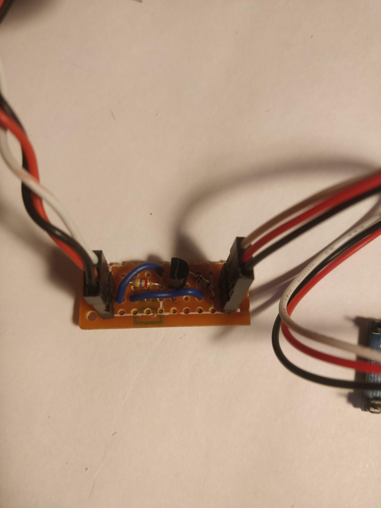
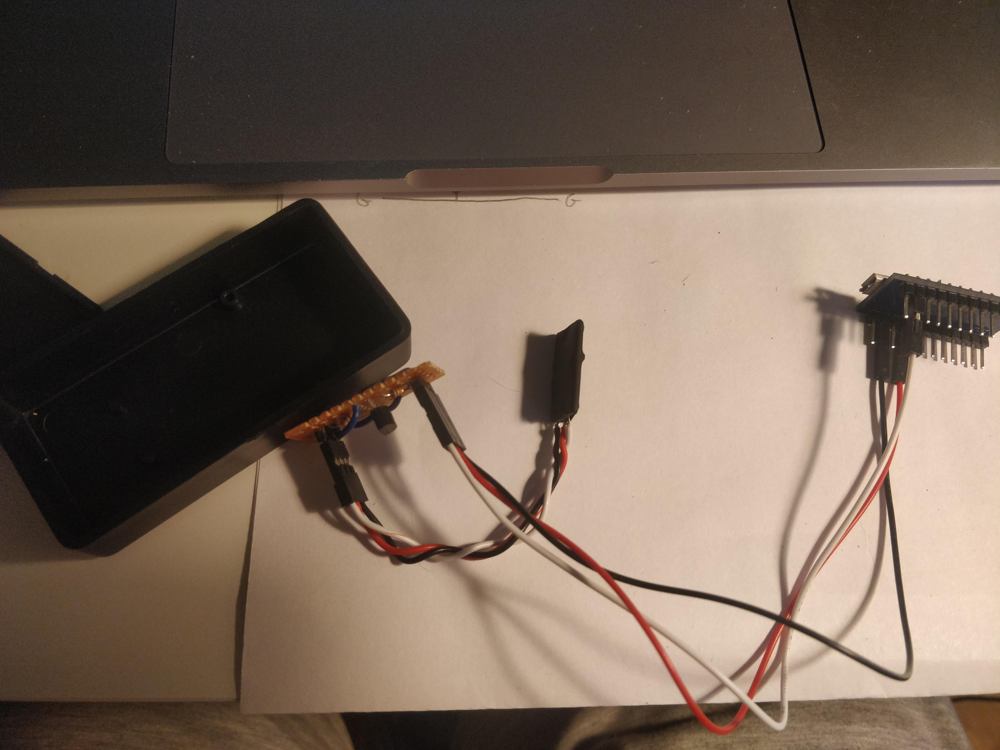
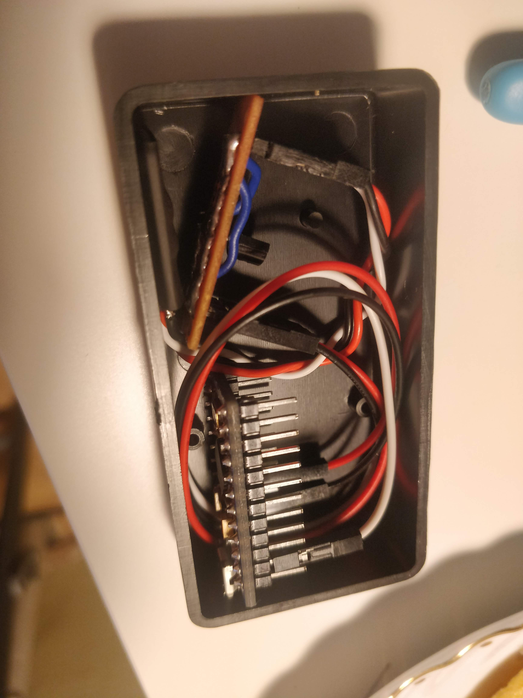

# SBUS Joy

**The code is still WIP!**

This project is an SBUS compatible virtual joystick with arduino and stuff.

I got a lot of help/idea from the following projects:
- https://github.com/MHeironimus/ArduinoJoystickLibrary
- https://github.com/froqstar/SBUSJoystick
- https://github.com/zendes/SBUS

Special thanks to the SBUSJoystick project which helped me to compile the SBUS lib and got a base for my code.


# Hardware setup

There are 3 required components for this project.

## SBUS receiver

I got an XM+ without atennas which is fine. I don't care about the range, because I'll sit in front of my computer with the transmitter. Any SBUS compatible receiver will work fine.

Don't forget to bind your radio to this and configure the transmitter to send the switches you want, etc. This is not part of this project.

## SBUS inverter circuit

I've used the one from Oscar Liang, but implemented it on a breadboard.
Source: https://oscarliang.com/sbus-smartport-telemetry-naze32/ (`SBUS Signal Inverter` part.)
The resistor wattage doesn't really matters, use wathever you have.




## Arduino with ATmega32u4

I used an `Arduino pro micro` (5V version) which is an `ATmega32u4` based small board, similar to the Arduino Leonardo.
I just simply connected the VCC, GND and RX1 ports to the inverter.


# Software setup

To compile this with Arduino you'll need to add these 2 dependencies first:

- https://github.com/MHeironimus/ArduinoJoystickLibrary
    To do this just simply follow the instructions: https://github.com/MHeironimus/ArduinoJoystickLibrary#installation-instructions

- https://github.com/zendes/SBUS
    If you have git installed on your machine, just follow the install steps: https://github.com/zendes/SBUS#basic-installation
    (Note: On OSX the `arduino-sketchbook` folder is by default: `~/Documents/Arduino`)

    If you don't have git, just download the .zip file from git and extract it under the libraries folder: `~/Documents/Arduino/libraries/SBUS`

Now the ticky part, the zendes SBUS library won't compile to the `ATmega32u4` because of some timer problems. To fix these I used the trick from the https://github.com/froqstar/SBUSJoystick repo:

Go into the installed SBUS lib folder (`~/Documents/Arduino/libraries/SBUS`) and open the `SBUS.cpp` and change these lines:

```
           TCCR2A  = 0;
           TCCR2B  = 0;
           TCNT2   = 0;
           OCR2A   = 249;
           TCCR2A |= (1 << WGM21);
           TCCR2B |= (1 << CS22);
           TIMSK2 |= (1 << OCIE2A);
```

To these:

```
           TCCR0A  = 0;
           TCCR0B  = 0;
           TCNT0   = 0;
           OCR0A   = 249;
           TCCR0A |= (1 << WGM01);
           TCCR0B |= (1 << CS00);
           TIMSK0 |= (1 << OCIE0A);
```


Now just open up the Arduino project file from my repo and it should compile. (Use the verify button first.)
If you connect to board to the PC, just upload the code and you are done.

You could even update the code on the Arduino even when everything is connected, because it has a dedicated USB circuit which is independet from the RX1 serial port on the board.

First I tried everything on a breadboard with the serial prints to check if everything works, here's a video about it:

[](https://youtu.be/k4_7HFKpz5E)

Then after some soldering I came up with this and tested again:



And I put everything in a smaller box:



# Alternatives

## Pre-built USB dongle

Use a pre-built solution like this one:
https://www.frsky-rc.com/product/xsr-sim/

## Use an FC

You have a spare flight controller with and older Betaflight than 3.4?
Use that as and emulator, check out this post: https://oscarliang.com/betaflight-fc-fpv-simulator/
